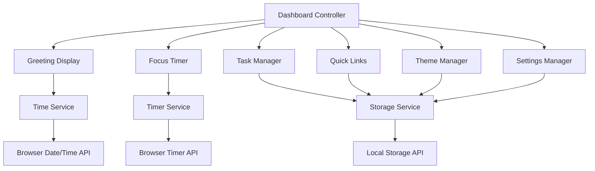

# Design Document: Productivity Dashboard

## Overview

The Productivity Dashboard is a client-side web application that combines essential productivity tools into a single, clean interface. Built with vanilla HTML, CSS, and JavaScript, it provides users with time management, task tracking, and quick access features while maintaining complete privacy through local data storage.

The application follows a component-based architecture where each major feature (greeting display, focus timer, task management, quick links, theme management, and settings management) operates as an independent module with clear interfaces and responsibilities. All components share a unified visual design system featuring customizable themes with light and dark modes.

Key architectural principles:
- **Client-side only**: No server dependencies, complete offline functionality
- **Local data persistence**: All user data stored in browser's Local Storage API
- **Component isolation**: Each feature module operates independently with minimal coupling
- **Progressive enhancement**: Core functionality works without JavaScript, enhanced with interactive features
- **Performance-first**: Sub-second load times with immediate user feedback

## Architecture

### System Architecture

The application follows a modular, event-driven architecture with six primary components:



### Component Architecture

Each component follows a consistent pattern:

1. **Presentation Layer**: DOM manipulation and event handling
2. **Business Logic Layer**: Core functionality and state management
3. **Data Layer**: Local storage operations and data validation

### Service Layer

**Time Service**: Manages current time, date formatting, and greeting logic
- Provides real-time updates every second
- Handles time-based greeting calculations
- Formats display strings consistently

**Timer Service**: Manages countdown functionality for focus sessions
- Implements Pomodoro technique (25-minute sessions)
- Handles start/stop/reset operations
- Provides completion notifications

**Storage Service**: Centralizes all Local Storage operations
- Provides consistent API for data persistence
- Handles storage errors and quota management
- Implements data validation and migration

## Components and Interfaces

### Greeting Display Component

**Purpose**: Shows current time, date, and contextual greeting

**Interface**:
```javascript
class GreetingDisplay {
  constructor(containerElement)
  start()                    // Begin real-time updates
  stop()                     // Stop updates
  updateDisplay()            // Force immediate update
}
```

**Responsibilities**:
- Display current time in HH:MM:SS format
- Display current date in "Day, Month DD, YYYY" format
- Show time-appropriate greeting (Morning/Afternoon/Evening/Night)
- Update display every second when active

**Dependencies**: Time Service

### Focus Timer Component

**Purpose**: Implements 25-minute Pomodoro focus sessions

**Interface**:
```javascript
class FocusTimer {
  constructor(containerElement)
  start()                    // Begin countdown
  stop()                     // Pause countdown
  reset()                    // Reset to 25:00
  getCurrentTime()           // Get current countdown value
  onComplete(callback)       // Register completion handler
}
```

**Responsibilities**:
- Maintain 25-minute countdown state
- Provide start/stop/reset controls
- Display time in MM:SS format
- Notify on completion
- Persist timer state during pause

**Dependencies**: Timer Service

### Task Manager Component

**Purpose**: Full CRUD operations for to-do list management

**Interface**:
```javascript
class TaskManager {
  constructor(containerElement)
  addTask(text)              // Create new task
  editTask(id, newText)      // Update task text
  toggleTask(id)             // Toggle completion status
  deleteTask(id)             // Remove task
  loadTasks()                // Restore from storage
  saveTasks()                // Persist to storage
}
```

**Responsibilities**:
- Create, read, update, delete tasks
- Toggle completion status with visual feedback
- Inline editing of task text
- Automatic persistence to Local Storage
- Restore tasks on application load

**Dependencies**: Storage Service

### Quick Links Component

**Purpose**: Manage customizable website shortcuts

**Interface**:
```javascript
class QuickLinks {
  constructor(containerElement)
  addLink(name, url)         // Create new link
  editLink(id, name, url)    // Update existing link
  deleteLink(id)             // Remove link
  openLink(id)               // Navigate to URL
  loadLinks()                // Restore from storage
  saveLinks()                // Persist to storage
}
```

**Responsibilities**:
- Create, read, update, delete quick links
- Validate URLs and provide user feedback
- Open links in new browser tabs
- Automatic persistence to Local Storage
- Restore links on application load

**Dependencies**: Storage Service

### Theme Manager Component

**Purpose**: Manages light and dark theme switching with persistence

**Interface**:
```javascript
class ThemeManager {
  constructor(containerElement)
  toggleTheme()              // Switch between light/dark themes
  setTheme(themeName)        // Set specific theme ('light' or 'dark')
  getCurrentTheme()          // Get current active theme
  loadTheme()                // Restore theme from storage
  saveTheme()                // Persist theme to storage
}
```

**Responsibilities**:
- Provide theme toggle control in UI
- Apply CSS classes for light/dark themes
- Persist theme preference to Local Storage
- Restore theme preference on load
- Maintain visual consistency across themes

**Dependencies**: Storage Service

### Settings Manager Component

**Purpose**: Manages user preferences including custom name and timer duration

**Interface**:
```javascript
class SettingsManager {
  constructor(containerElement)
  setCustomName(name)        // Set personalized greeting name
  getCustomName()            // Get current custom name
  setTimerDuration(minutes)  // Set custom timer duration
  getTimerDuration()         // Get current timer duration
  loadSettings()             // Restore settings from storage
  saveSettings()             // Persist settings to storage
  validateInput(value, type) // Validate user input
}
```

**Responsibilities**:
- Provide settings interface for customization
- Validate and sanitize user input
- Manage custom greeting name (max 50 characters)
- Manage timer duration (1-120 minutes)
- Persist all settings to Local Storage
- Restore settings on application load

**Dependencies**: Storage Service

### Dashboard Controller

**Purpose**: Coordinate component lifecycle and global application state

**Interface**:
```javascript
class Dashboard {
  constructor()
  initialize()               // Setup all components
  handleStorageError(error)  // Global error handling
  checkBrowserSupport()      // Validate browser capabilities
}
```

**Responsibilities**:
- Initialize all components in correct order
- Handle global error conditions
- Manage application lifecycle
- Coordinate cross-component interactions

## Data Models

### Task Model

```javascript
{
  id: string,           // Unique identifier (UUID)
  text: string,         // Task description
  completed: boolean,   // Completion status
  createdAt: Date,      // Creation timestamp
  updatedAt: Date       // Last modification timestamp
}
```

**Validation Rules**:
- `id`: Required, must be unique UUID
- `text`: Required, 1-500 characters, no HTML
- `completed`: Required boolean
- `createdAt`: Required, valid Date object
- `updatedAt`: Required, valid Date object, >= createdAt

### Quick Link Model

```javascript
{
  id: string,           // Unique identifier (UUID)
  name: string,         // Display name
  url: string,          // Target URL
  createdAt: Date,      // Creation timestamp
  updatedAt: Date       // Last modification timestamp
}
```

**Validation Rules**:
- `id`: Required, must be unique UUID
- `name`: Required, 1-50 characters, no HTML
- `url`: Required, valid HTTP/HTTPS URL
- `createdAt`: Required, valid Date object
- `updatedAt`: Required, valid Date object, >= createdAt

### Timer State Model

```javascript
{
  remainingTime: number,    // Milliseconds remaining
  isRunning: boolean,       // Current running state
  startTime: Date,          // When current session started
  totalDuration: number     // Total session length (25 minutes)
}
```

**Validation Rules**:
- `remainingTime`: Required, 0 <= value <= totalDuration
- `isRunning`: Required boolean
- `startTime`: Required when isRunning is true
- `totalDuration`: Required, configurable duration in milliseconds (60000-7200000, representing 1-120 minutes)

### Settings Model

```javascript
{
  customName: string,       // User's personalized name for greeting
  timerDuration: number,    // Timer duration in minutes (1-120)
  theme: string,            // Current theme ('light' or 'dark')
  createdAt: Date,          // Settings creation timestamp
  updatedAt: Date           // Last modification timestamp
}
```

**Validation Rules**:
- `customName`: Optional, 0-50 characters, no HTML tags
- `timerDuration`: Required, integer 1-120
- `theme`: Required, must be 'light' or 'dark'
- `createdAt`: Required, valid Date object
- `updatedAt`: Required, valid Date object, >= createdAt

### Storage Schema

**Local Storage Keys**:
- `productivity-dashboard-tasks`: Array of Task objects
- `productivity-dashboard-links`: Array of Quick Link objects
- `productivity-dashboard-timer`: Timer State object
- `productivity-dashboard-settings`: Settings object
- `productivity-dashboard-version`: Schema version for migrations

**Storage Format**:
```javascript
{
  version: "1.0.0",
  tasks: Task[],
  links: QuickLink[],
  timer: TimerState,
  settings: Settings,
  lastUpdated: Date
}
```

## Correctness Properties

*A property is a characteristic or behavior that should hold true across all valid executions of a system-essentially, a formal statement about what the system should do. Properties serve as the bridge between human-readable specifications and machine-verifiable correctness guarantees.*

### Property 1: Time Format Consistency

*For any* valid time value, the time formatting function should produce a string in exactly HH:MM:SS format with zero-padded hours, minutes, and seconds.

**Validates: Requirements 1.1**

### Property 2: Date Format Consistency

*For any* valid date value, the date formatting function should produce a string in exactly "Day, Month DD, YYYY" format with full day and month names.

**Validates: Requirements 1.2**

### Property 3: Time-Based Greeting Accuracy

*For any* time value, the greeting function should return "Good Morning" for 05:00-11:59, "Good Afternoon" for 12:00-16:59, "Good Evening" for 17:00-20:59, and "Good Night" for 21:00-04:59.

**Validates: Requirements 1.3, 1.4, 1.5, 1.6**

### Property 4: Timer Format Consistency

*For any* timer state with remaining time, the timer display function should produce a string in exactly MM:SS format with zero-padded minutes and seconds.

**Validates: Requirements 2.6**

### Property 5: Timer Countdown Behavior

*For any* running timer, advancing time should decrease the remaining time by the same amount until it reaches zero.

**Validates: Requirements 2.2**

### Property 6: Timer Pause State Preservation

*For any* timer state, pausing and then immediately checking the remaining time should return the same value as before the pause.

**Validates: Requirements 2.3, 2.8**

### Property 7: Timer Reset Consistency

*For any* timer state, regardless of current remaining time or running status, reset should always return the timer to exactly 25 minutes (1500000 milliseconds).

**Validates: Requirements 2.4**

### Property 8: Task Creation Consistency

*For any* valid task text input, creating a new task should result in a task object with that exact text, a unique ID, completed status of false, and valid timestamps.

**Validates: Requirements 3.2**

### Property 9: Task Completion Toggle

*For any* task, toggling its completion status should change it from true to false or from false to true, preserving all other task properties.

**Validates: Requirements 3.4**

### Property 10: Task Deletion Consistency

*For any* task list and any task ID that exists in that list, deleting the task should result in a list that no longer contains that task and has length reduced by one.

**Validates: Requirements 3.5**

### Property 11: Link Creation Consistency

*For any* valid link name and URL, creating a new link should result in a link object with that exact name and URL, a unique ID, and valid timestamps.

**Validates: Requirements 4.2**

### Property 12: Link Editing Consistency

*For any* existing link and any valid new name and URL, editing the link should update only the name, URL, and updatedAt timestamp while preserving the ID and createdAt timestamp.

**Validates: Requirements 4.6**

### Property 13: Link Deletion Consistency

*For any* link list and any link ID that exists in that list, deleting the link should result in a list that no longer contains that link and has length reduced by one.

**Validates: Requirements 4.7**

### Property 14: Storage Round-Trip Consistency

*For any* valid application state (tasks and links), saving to storage and then loading should produce an equivalent state with the same data.

**Validates: Requirements 3.7, 3.8, 4.4, 4.5, 5.2, 5.3, 5.4**

### Property 16: Custom Name Greeting Integration

*For any* valid custom name and time value, the greeting function should append the custom name to the time-based greeting when a name is set, and show only the time-based greeting when no name is set.

**Validates: Requirements 9.2, 9.3**

### Property 17: Theme Consistency

*For any* theme setting ('light' or 'dark'), applying the theme should result in consistent visual styling across all components with appropriate contrast and readability.

**Validates: Requirements 8.2, 8.3, 8.7**

### Property 18: Timer Duration Validation

*For any* timer duration value, the validation function should accept integers between 1 and 120 minutes and reject all other values.

**Validates: Requirements 10.2**

### Property 19: Settings Persistence Round-Trip

*For any* valid settings object (custom name, timer duration, theme), saving to storage and then loading should produce an equivalent settings object with the same values.

**Validates: Requirements 8.4, 8.5, 9.4, 9.5, 10.4, 10.5**

### Property 20: Timer Duration Application

*For any* valid timer duration setting, creating a new timer session should initialize with exactly that duration in milliseconds.

**Validates: Requirements 10.3, 10.6**

## Error Handling

### Storage Error Management

**Local Storage Unavailability**:
- Detect when Local Storage API is not available
- Display clear warning message to user
- Provide graceful degradation with in-memory storage
- Inform user that data will not persist between sessions

**Storage Quota Exceeded**:
- Catch and handle QuotaExceededError exceptions
- Attempt to free space by removing oldest data
- Display user-friendly error message with guidance
- Provide option to export data before cleanup

**Data Corruption**:
- Validate data structure on load
- Handle malformed JSON gracefully
- Provide data recovery options when possible
- Reset to clean state as last resort

### Timer Error Handling

**Invalid Timer States**:
- Validate timer state on initialization
- Handle negative or excessive time values
- Ensure timer cannot exceed maximum duration
- Provide automatic correction for invalid states

**Browser Tab Visibility**:
- Detect when tab becomes inactive
- Pause timer updates to conserve resources
- Resume accurate timing when tab becomes active
- Maintain timer accuracy across visibility changes

### Input Validation

**Task Input Validation**:
- Reject empty or whitespace-only task text
- Limit task text to maximum 500 characters
- Sanitize input to prevent XSS attacks
- Provide immediate feedback for invalid input

**Link Input Validation**:
- Validate URL format using URL constructor
- Require HTTP or HTTPS protocols
- Limit link names to maximum 50 characters
- Sanitize input to prevent XSS attacks

### Network and Browser Compatibility

**Feature Detection**:
- Check for Local Storage support before use
- Detect required JavaScript features
- Provide fallbacks for unsupported browsers
- Display compatibility warnings when needed

**Graceful Degradation**:
- Core functionality works without JavaScript
- Progressive enhancement for interactive features
- Maintain usability across different browser versions
- Provide alternative interfaces for accessibility

## Testing Strategy

### Dual Testing Approach

The application will use both unit testing and property-based testing to ensure comprehensive coverage:

**Unit Tests**: Focus on specific examples, edge cases, and error conditions
- Test specific time/date formatting examples
- Test timer initialization with 25:00
- Test storage error scenarios
- Test browser compatibility edge cases
- Test UI component integration points

**Property Tests**: Verify universal properties across all inputs using fast-check library
- Run minimum 100 iterations per property test
- Generate random inputs to test formatting functions
- Test timer behavior across various states
- Validate storage operations with random data
- Each property test references its design document property

### Property-Based Testing Configuration

**Library**: fast-check (JavaScript property-based testing library)
**Test Runner**: Jest or Vitest for test execution
**Iterations**: Minimum 100 per property test
**Tagging**: Each test tagged with format: **Feature: productivity-dashboard, Property {number}: {property_text}**

### Unit Testing Focus Areas

**Specific Examples**:
- Timer completion notification at 00:00
- Storage unavailable warning display
- Storage quota exceeded error handling
- Specific greeting times (e.g., 06:00 → "Good Morning")

**Integration Points**:
- Component initialization sequence
- Cross-component event handling
- Storage service integration
- DOM manipulation and event binding

**Edge Cases**:
- Empty task lists and link lists
- Maximum data limits (100 tasks, 20 links)
- Browser tab visibility changes
- Local Storage quota limits

### Performance Testing

**Load Time Validation**:
- Measure initial page load time
- Test with maximum data loads (100 tasks, 20 links)
- Validate sub-second component initialization
- Monitor memory usage during extended use

**Interaction Response Time**:
- Measure user interaction response times
- Validate 100ms response requirement
- Test with large datasets
- Monitor for memory leaks during extended use

### Browser Compatibility Testing

**Target Browsers**:
- Chrome 90+ (automated testing)
- Firefox 88+ (automated testing)
- Edge 90+ (manual verification)
- Safari 14+ (manual verification)

**Testing Approach**:
- Automated tests run on Chrome and Firefox
- Manual verification on Edge and Safari
- Feature detection tests for all browsers
- Graceful degradation validation

### Test Organization

```
tests/
├── unit/
│   ├── components/
│   │   ├── greeting-display.test.js
│   │   ├── focus-timer.test.js
│   │   ├── task-manager.test.js
│   │   └── quick-links.test.js
│   ├── services/
│   │   ├── time-service.test.js
│   │   ├── timer-service.test.js
│   │   └── storage-service.test.js
│   └── integration/
│       └── dashboard.test.js
└── property/
    ├── formatting.property.test.js
    ├── timer.property.test.js
    ├── tasks.property.test.js
    ├── links.property.test.js
    └── storage.property.test.js
```

Each property test will include a comment referencing its design document property:
```javascript
// Feature: productivity-dashboard, Property 1: Time Format Consistency
test('time formatting produces HH:MM:SS format', () => {
  fc.assert(fc.property(
    fc.integer(0, 23), fc.integer(0, 59), fc.integer(0, 59),
    (hours, minutes, seconds) => {
      const time = new Date();
      time.setHours(hours, minutes, seconds);
      const formatted = formatTime(time);
      expect(formatted).toMatch(/^\d{2}:\d{2}:\d{2}$/);
    }
  ), { numRuns: 100 });
});
```

This comprehensive testing strategy ensures both specific correctness (unit tests) and general correctness (property tests) while maintaining performance and compatibility requirements.