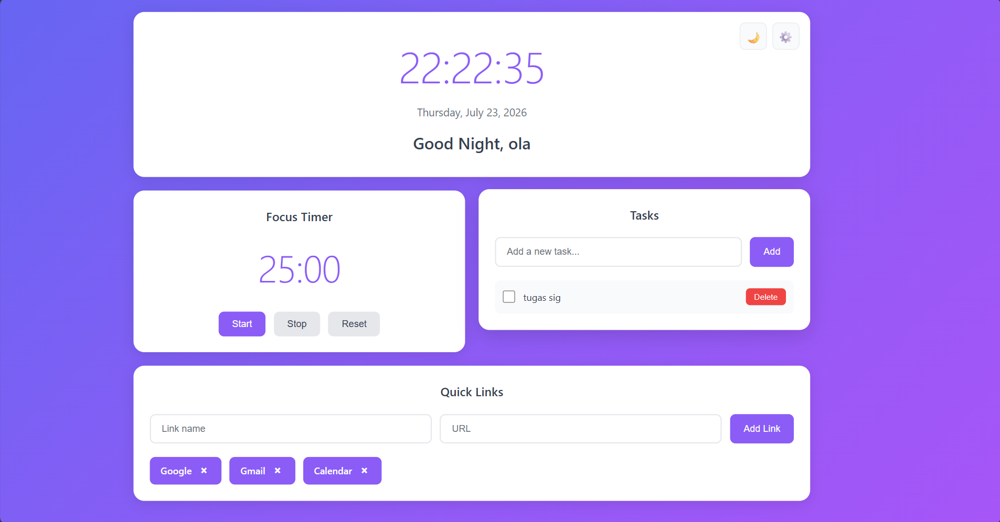

# Productivity Dashboard

A simple productivity dashboard built with HTML, CSS, and JavaScript to help users organize tasks and manage focus time.

## Preview

## Features

- **Dynamic Greeting & Clock** — Displays the current time, date, and greeting based on the time of day.
- **Focus Timer** — 25-minute focus timer with start, stop, and reset controls.
- **Task Manager** — Add, complete, and delete daily tasks.
- **Quick Links** — Add and manage shortcuts to frequently visited websites.
- **Local Storage** — Stores tasks, links, and user preferences locally in the browser.
- **Light/Dark Mode** — Allows users to switch the dashboard appearance.

## Tech Stack

- HTML
- CSS
- JavaScript
- Local Storage

## Live Demo

[View Productivity Dashboard](https://olasuh.github.io/productivity-dashboard/)

## About This Project

This project was developed as a mini project during the RevoU Coding Camp – Intro to Software Engineering. It was created to practice fundamental web development concepts using HTML, CSS, and JavaScript.

## Author

**Rafa Naura Harahap**

Information Systems Student  
Universitas Dinamika Bangsa
